# System Flow Diagrams — vercel-openclaw

All major flows extracted from the codebase, rendered as Mermaid diagrams.

---

## 1. Authentication Flow

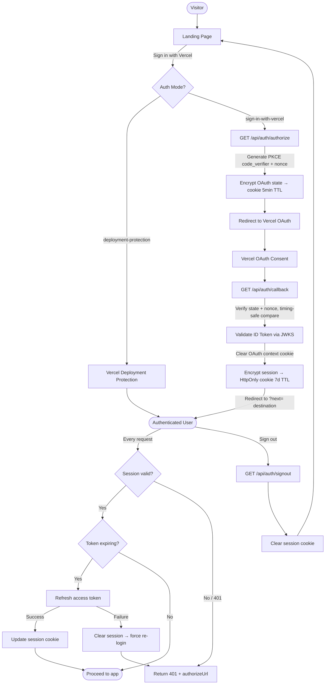

---

## 2. Sandbox Lifecycle

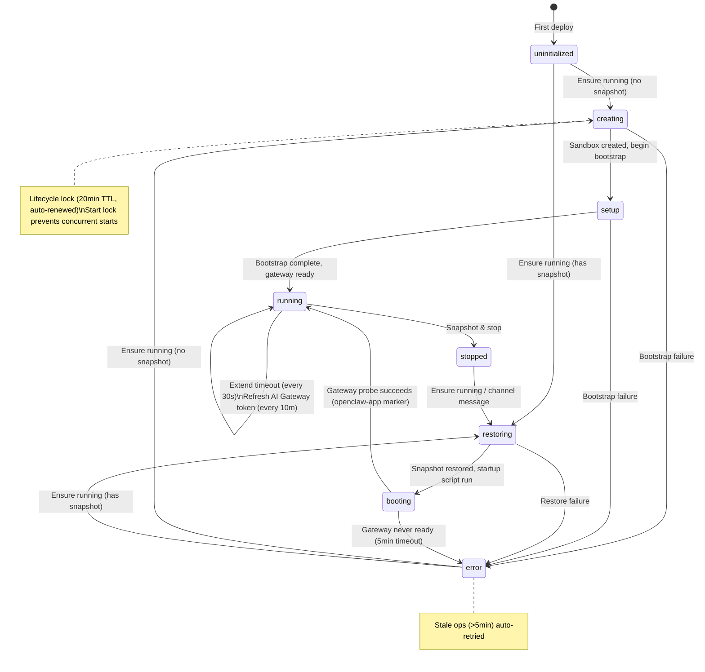

---

## 3. Sandbox Creation & Bootstrap

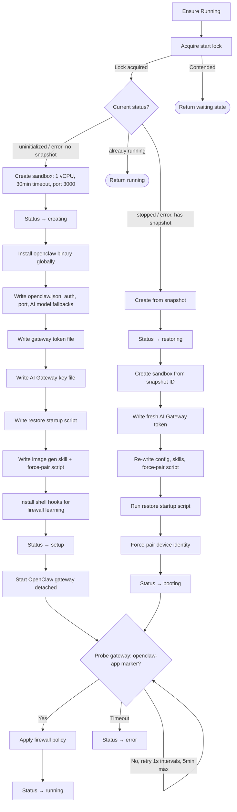

---

## 4. Gateway Proxy Flow

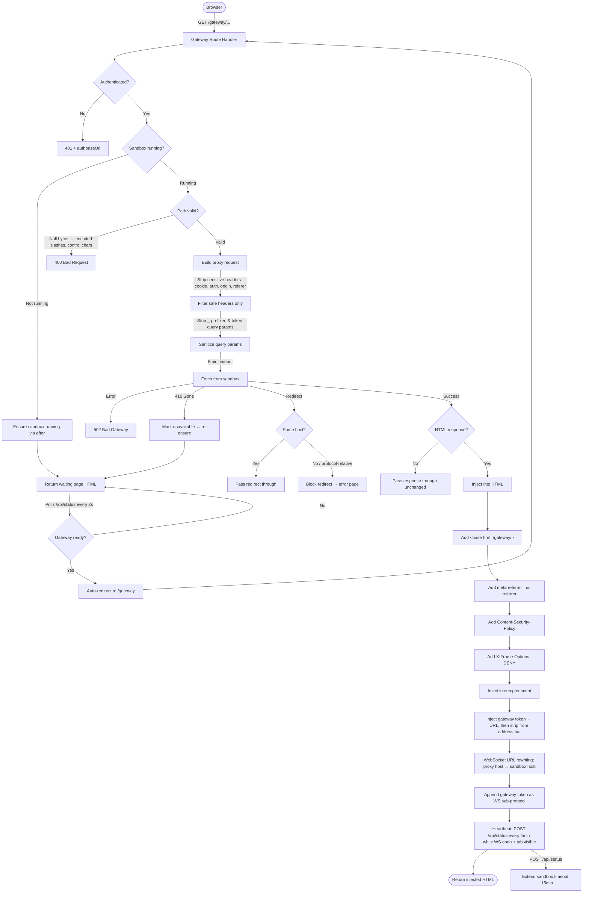

---

## 5. Firewall Lifecycle

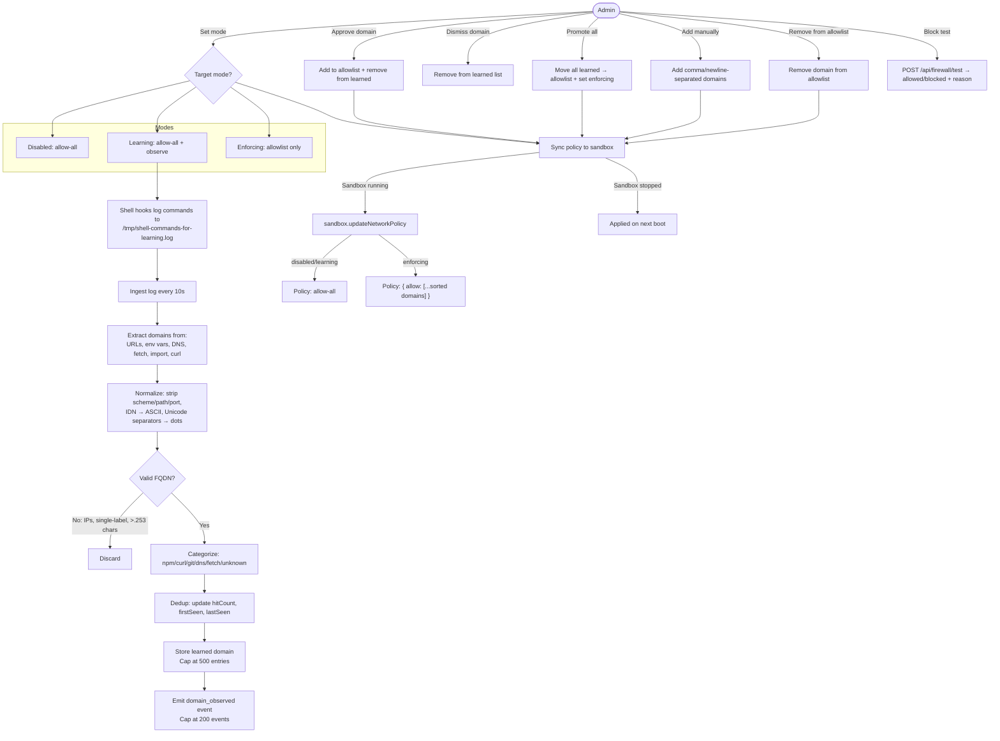

---

## 6. Channel Message Flow

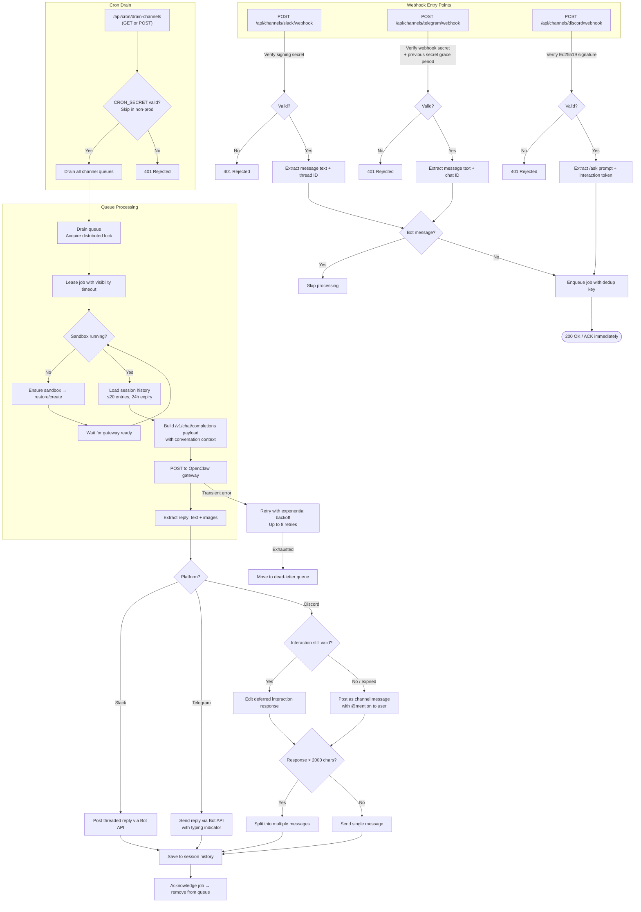

---

## 7. Channel Configuration Flow

```mermaid
flowchart TD
    subgraph "Slack Setup"
        slackStart([Admin: Channels → Slack]) --> slackConfigured{Already connected?}
        slackConfigured --> |No| slackWizard[Step 1: Create Slack App via manifest]
        slackWizard --> slackCreds[Step 2: Paste Signing Secret + Bot Token xoxb-]
        slackCreds --> slackTest[Test Connection → team, user, botId]
        slackTest --> slackSave[Save credentials]
        slackSave --> slackWebhook[Step 3: Copy webhook URL → Slack Event Subscriptions]
        slackConfigured --> |Yes| slackView[View: workspace, botId, webhook URL, queue depth]
        slackView --> slackUpdate[Update credentials]
        slackView --> slackDisconnect[Disconnect with confirmation]
    end

    subgraph "Telegram Setup"
        tgStart([Admin: Channels → Telegram]) --> tgConfigured{Already connected?}
        tgConfigured --> |No| tgWizard[Step 1: Create bot via @BotFather]
        tgWizard --> tgToken[Step 2: Paste bot token]
        tgToken --> tgPreview[Preview bot → name, username]
        tgPreview --> tgSave[Save & Connect → register webhook + generate secret]
        tgConfigured --> |Yes| tgView[View: bot username, webhook URL, status, queue]
        tgView --> tgUpdate[Update token]
        tgView --> tgDisconnect[Disconnect with confirmation]
    end

    subgraph "Discord Setup"
        dcStart([Admin: Channels → Discord]) --> dcConfigured{Already connected?}
        dcConfigured --> |No| dcWizard[Step 1: Create app in Developer Portal]
        dcWizard --> dcToken[Step 2: Paste bot token]
        dcToken --> dcOptions["Options:\n☑ Auto-configure endpoint\n☑ Register /ask command\n☐ Force overwrite endpoint"]
        dcOptions --> dcConnect[Connect → multi-phase progress:\nValidating → Saving → Endpoint → /ask]
        dcConfigured --> |Yes| dcView["Checklist:\n✓ Token validated\n✓ Endpoint configured\n✓ /ask registered\n✓ Bot invite URL"]
        dcView --> dcRegister[Register /ask command separately]
        dcView --> dcInvite[Invite bot to server]
        dcView --> dcDetails["Details: App ID, Public Key, Webhook URL (copyable)"]
        dcView --> dcUpdate[Update token]
        dcView --> dcDisconnect[Disconnect with confirmation]
    end
```

---

## 8. Admin UI Navigation & Status Polling

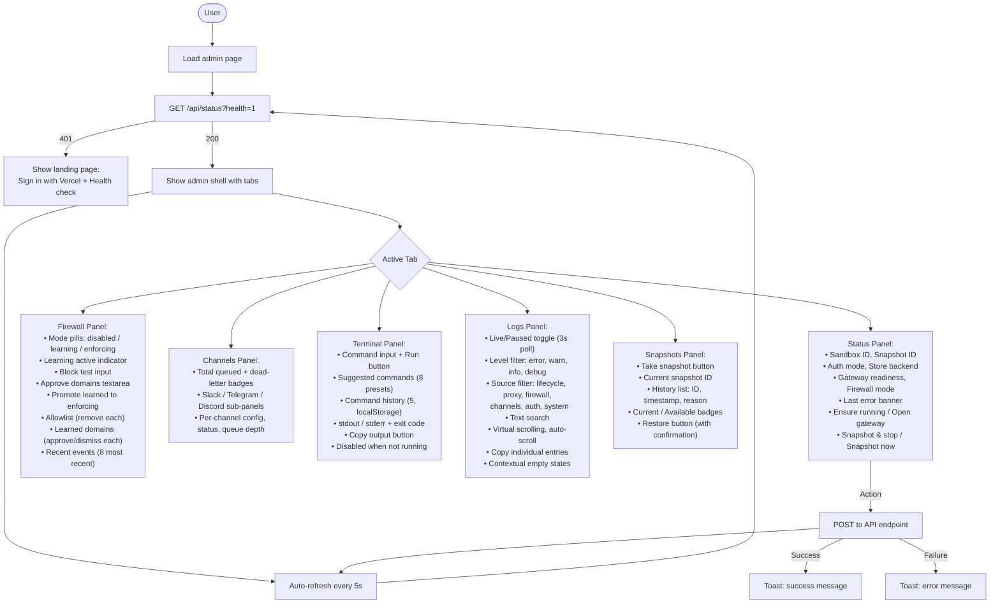

---

## 9. Store & Persistence Architecture

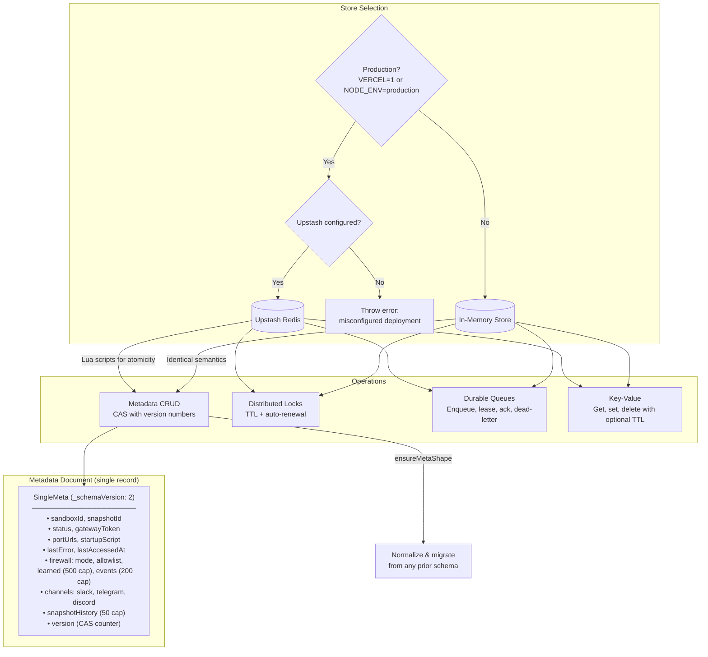

---

## 10. End-to-End: First Visit to AI Response

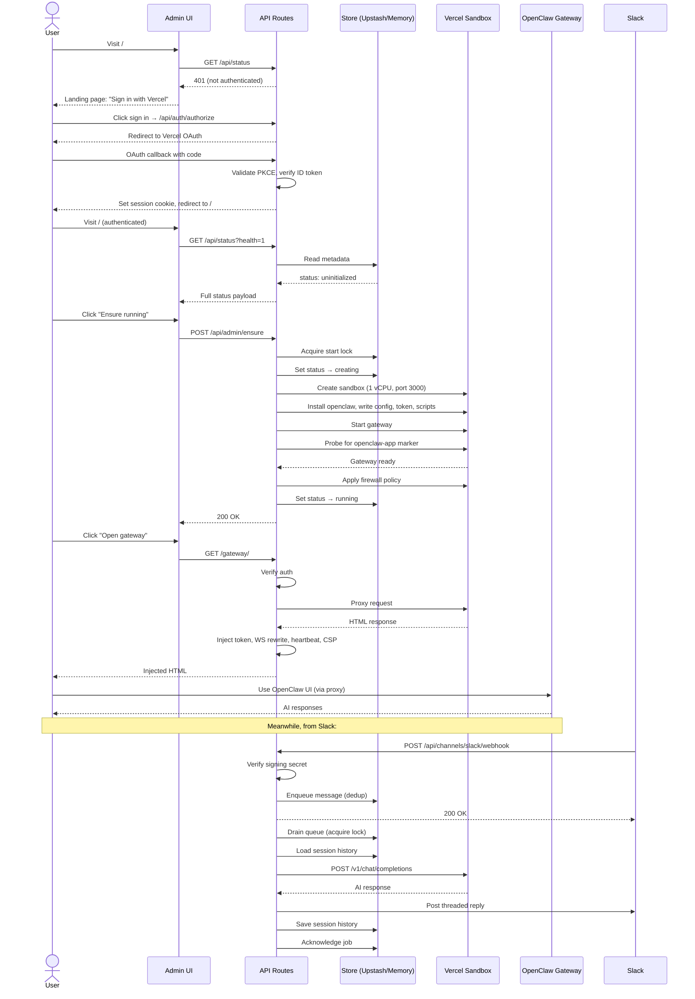

---

## 11. Smoke Testing Flow

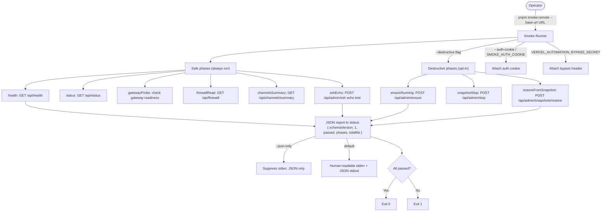
