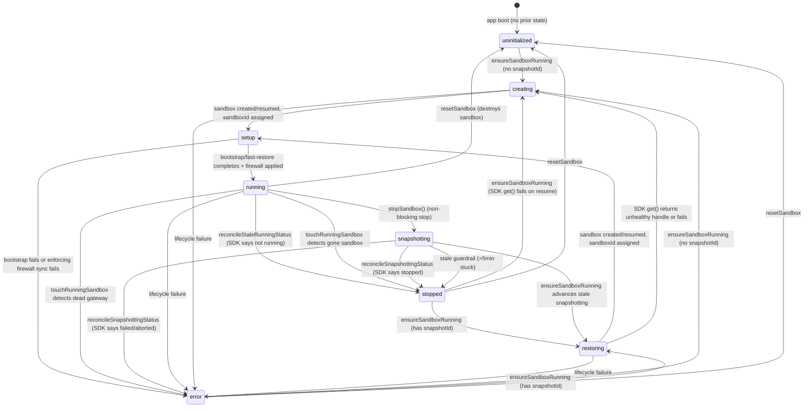
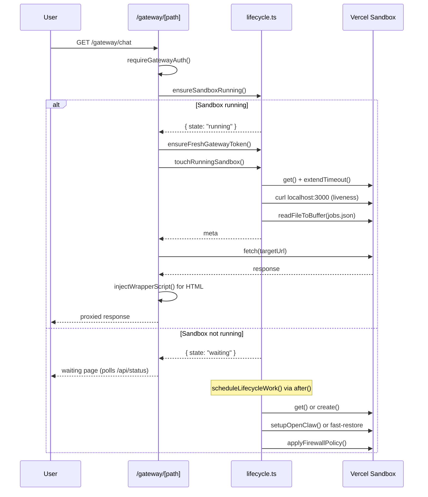
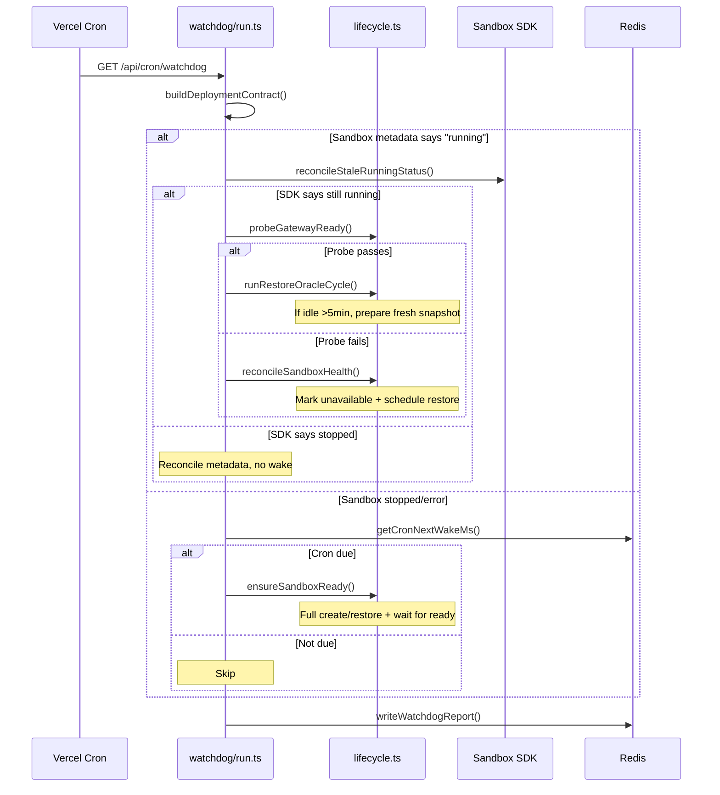
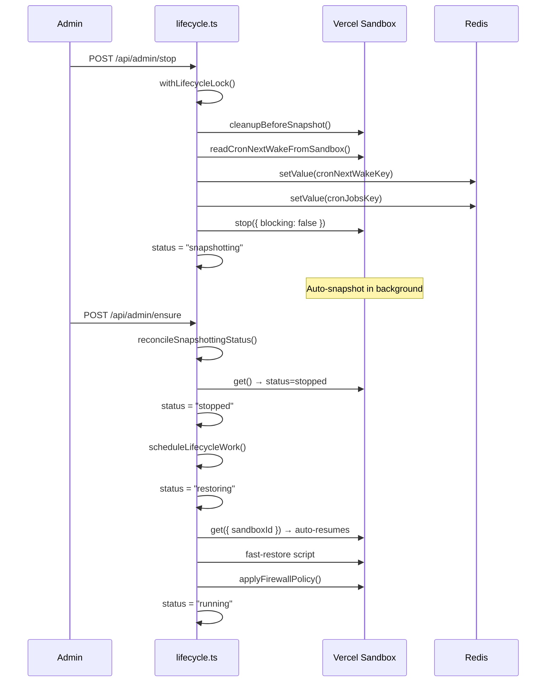
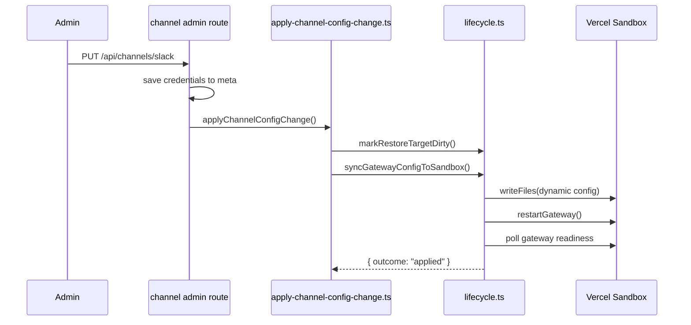
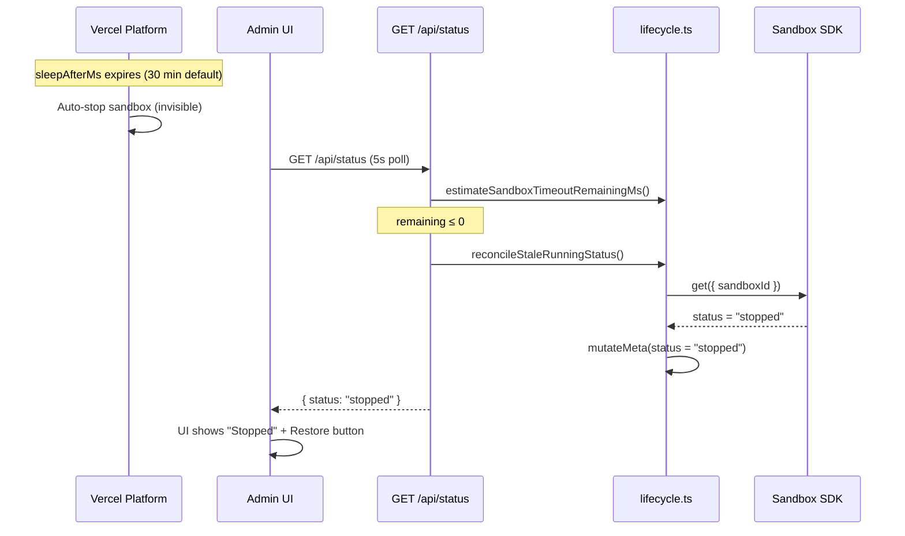
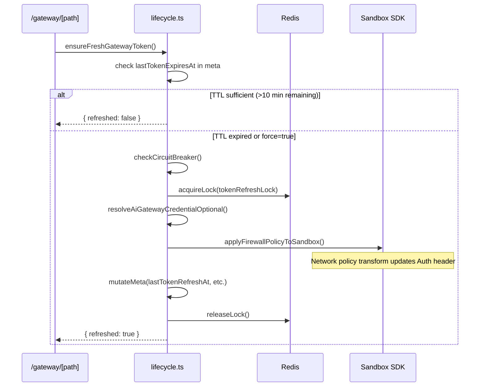

# Sandbox Lifecycle

Complete audit of every code path that creates, resumes, stops, sleeps, wakes, resets, or otherwise mutates the Vercel Sandbox state in the vercel-openclaw app.

## Status State Machine

The sandbox status is tracked in `SingleMeta.status` and follows this state machine. All transitions happen via [[src/server/sandbox/lifecycle.ts]] through `mutateMeta()`.

## Triggers — What Causes State Transitions

Every external event that can change the sandbox status, grouped by origin.

### User-initiated (Admin API)

Admin routes that directly trigger sandbox mutations via [[src/server/sandbox/lifecycle.ts]].

#### POST /api/admin/ensure

Calls `ensureSandboxRunning()` (async) or `ensureSandboxReady()` (with `?wait=1`).

The `schedule: after` parameter defers the heavy create/restore work to a Next.js `after()` callback. This is the primary "wake up the sandbox" trigger from the admin UI.

#### POST /api/admin/stop

Calls `stopSandbox()`. Acquires lifecycle lock, runs pre-snapshot cleanup, persists cron jobs, calls `sandbox.stop({ blocking: false })`, transitions to `snapshotting`.

#### POST /api/admin/snapshot

Alias for `stopSandbox()` via `snapshotSandbox()`.

#### POST /api/admin/reset

Calls `resetSandbox()` via `after()`. Destroys the sandbox, deletes all tracked snapshots, clears cron state, transitions to `uninitialized`.

#### POST /api/admin/snapshots (manual snapshot)

Takes a manual snapshot of the running sandbox, bypassing `stopSandbox()`.

Calls `sandbox.snapshot()`, records in `snapshotHistory` (cap 50), sets `snapshotId`, clears `sandboxId`, transitions to `stopped`. No pre-snapshot cleanup, no cron persistence, no non-blocking stop.

#### POST /api/admin/snapshots/restore

Restores from a specific snapshot in history. Sets `snapshotId` to the target, clears `sandboxId`, transitions to `stopped`, then calls `ensureSandboxRunning()` to trigger the restore. This is a sandbox lifecycle trigger.

#### POST /api/admin/snapshots/delete

Deletes a snapshot from Vercel and removes it from `snapshotHistory`. Cannot delete the current `snapshotId` — returns 409. If the Vercel API returns 404 (already gone), the history entry is still cleaned up.

#### POST /api/admin/prepare-restore

Calls `prepareRestoreTarget()`. When `destructive: true`, reconciles dynamic config, syncs assets, verifies gateway readiness, then snapshots. Used by launch-verify.

#### POST /api/admin/refresh-token

Calls `ensureFreshGatewayToken({ force: true })`. Refreshes the OIDC token and updates the firewall network policy.

### Gateway traffic (Proxy)

The `src/app/gateway/[[...path]]/route.ts` proxy route triggers sandbox state changes on every incoming request.

#### Gateway request flow

Step-by-step sequence of sandbox interactions during a proxied gateway request.

1. Auth check (admin cookie or bearer)
2. `ensureSandboxRunning()` — if not running, schedules create/restore and returns waiting page
3. `ensureFreshGatewayToken()` — proactive OIDC refresh (throttled)
4. `touchRunningSandbox()` — extends timeout, persists cron wake, detects dead gateway
5. If `touchRunningSandbox` finds sandbox gone → `ensureSandboxRunning()` re-triggered
6. Proxy to sandbox, handle 401 (force token refresh + retry) and 410 (reconcile health)

### Heartbeat (Status API)

Browser-injected JavaScript and the admin UI poll the status API to keep the sandbox alive.

#### POST /api/status

Called by the injected browser JavaScript every `heartbeatIntervalMs` (~4 min). Calls `touchRunningSandbox()` which extends the sandbox timeout and runs gateway liveness checks.

#### GET /api/status

Returns sandbox state. When metadata says "running" but estimated timeout elapsed, calls `reconcileStaleRunningStatus()`. When status is "snapshotting", calls `reconcileSnapshottingStatus()`.

### Watchdog (Cron)

The [[src/app/api/cron/watchdog/route.ts]] cron route runs periodically (configured in vercel.json). It delegates to [[src/server/watchdog/run.ts]] `runSandboxWatchdog()`.

#### Watchdog decision tree

Ordered checks the watchdog runs on each tick to determine what action (if any) to take.

1. **Deployment contract check** — verifies env vars and configuration
2. **Stuck busy detection** — if status is creating/restoring/setup/booting with no sandboxId for >90s, triggers repair via `reconcileSandboxHealth()`
3. **Not running** — watchdog does NOT wake idle sandboxes (skips)
4. **Running — stale check** — calls `reconcileStaleRunningStatus()`. If SDK says stopped, metadata reconciled, no wake
5. **Running — gateway probe** — calls `probeGatewayReady()`
   - **Probe passes** → runs restore oracle cycle (prepare next restore target if idle enough)
   - **Probe fails** → `reconcileSandboxHealth()` marks unavailable and triggers restore
6. **Cron wake** — if sandbox is stopped/error with resumable target and `cronNextWakeMs <= now`, calls `ensureSandboxReady()` to wake the sandbox for scheduled jobs

### Channel webhooks (Slack, Telegram, WhatsApp, Discord)

Incoming webhook messages reconcile stale state and can trigger full sandbox wakes.

Each channel webhook route (`src/app/api/channels/{slack,telegram,whatsapp,discord}/webhook/route.ts`) uses a two-phase approach:

**Phase 1 — Fast path (webhook route itself):** If sandbox appears running and the channel's native handler is verified ready (e.g., `telegramListenerReady` in restore metrics), the route forwards directly to the sandbox's native handler port. On network failure, it calls `reconcileStaleRunningStatus()` to update metadata.

**Phase 2 — Workflow wake path:** If the sandbox isn't running or the fast path fails, the route starts a Vercel Workflow (`drainChannelWorkflow`) that calls `ensureSandboxReady()` (blocking until sandbox is running). Telegram sends a "Waking up..." boot message to the user before starting the workflow for immediate feedback. If the workflow start fails, the boot message is best-effort deleted to avoid orphaned "Waking up..." messages in the chat.

The Telegram webhook also has a dedup lock (24h TTL) to prevent duplicate processing of the same `update_id`. If the workflow start fails after dedup lock acquisition, the lock is released so Telegram can redeliver.

Key sandbox interactions in the workflow:
- `runWithBootMessages()` → `ensureSandboxReady()` — blocks until sandbox is running
- `getSandboxDomain()` — gets the sandbox URL for forwarding
- `ensureUsableAiGatewayCredential()` — refreshes OIDC token if needed
- Forward to native handler on port 8787 (Telegram) or port 3000 (others)

### Channel config changes

When channel credentials are saved/removed via admin routes, [[src/server/channels/admin/apply-channel-config-change.ts]] calls:
1. `markRestoreTargetDirty()` — marks next restore as stale
2. `syncGatewayConfigToSandbox()` — writes new config files, restarts gateway, polls readiness

### Firewall policy changes

`applyFirewallPolicyToSandbox()` in [[src/server/firewall/policy.ts]] calls `sandbox.updateNetworkPolicy()`. Triggered during:
- Fresh sandbox create (after bootstrap)
- Persistent sandbox resume (after fast-restore)
- Token refresh (`refreshAiGatewayToken`)
- Dynamic config reconciliation

### Platform-initiated (Implicit)

The Vercel Sandbox platform auto-stops sandboxes after `sleepAfterMs` (default 30 min). This is invisible to the app — metadata still says "running" until something reconciles:
- `touchRunningSandbox()` detects via SDK status check
- `reconcileStaleRunningStatus()` detects via SDK get()
- `estimateSandboxTimeoutRemainingMs()` predicts via timestamp math
- GET /api/status reconciles when estimated timeout ≤ 0

## Key Lifecycle Functions

Detailed behavior of each function in [[src/server/sandbox/lifecycle.ts]].

### ensureSandboxRunning

Entry point for "make the sandbox available." Does NOT block — returns `{ state: "running" | "waiting" }`. Schedules heavy work via `scheduleLifecycleWork()`.

Decision tree:
1. If `snapshotting` → try `reconcileSnapshottingStatus()` first
2. If `running` with sandboxId → check estimated timeout. If expired, `reconcileSandboxHealth()`. Otherwise return running.
3. If busy status (creating/setup/restoring/booting/snapshotting) → if stale (>5min), re-schedule; else return waiting
4. Otherwise → schedule create (no snapshotId) or restore (has snapshotId)

### stopSandbox

Acquires lifecycle lock. Pre-snapshot cleanup removes logs and temp files. Reads cron jobs from sandbox and persists to store. Calls `sandbox.stop({ blocking: false })`. Transitions to `snapshotting`. Optionally pre-creates a hot-spare sandbox.

Edge case: if sandbox is already gone (404/410 from SDK), transitions to `uninitialized` instead of throwing.

### touchRunningSandbox

Called by heartbeat and gateway proxy. Throttled to `touchThrottleMs` (~7.5s). Extends sandbox timeout, checks SDK status, runs internal gateway liveness curl, persists cron wake time.

If SDK says sandbox not running → `markSandboxUnavailable()`.
If gateway liveness curl fails → `markSandboxUnavailable()`.
If extend timeout fails → `markSandboxUnavailable()`.

### createAndBootstrapSandbox

The heavy lifting. Acquires lifecycle + start locks.

1. Hot-spare promotion (if enabled): try to promote pre-created candidate
2. `getSandboxController().get({ sandboxId })` — auto-resumes stopped persistent sandbox
3. If get() returns unhealthy handle (failed/error/aborted) → delete it, fall back to create()
4. If get() throws → fresh `create()` with persistent=true
5. Detect resumed vs fresh via `which openclaw` stat check
6. **Resumed path**: fast-restore script (update tokens/config, restart gateway), firewall policy, record metrics
7. **Fresh path**: full `setupOpenClaw()` bootstrap, firewall policy
8. Transition to `running`

### reconcileSandboxHealth

Single authority for health checks. When metadata says "running", probes the gateway. If probe fails, marks unavailable and schedules recovery via `ensureSandboxRunning()`. Also force-refreshes the OIDC token on success.

### resetSandbox

Acquires lifecycle lock. Stops sandbox (best-effort), deletes it, deletes all tracked snapshots, clears cron state, resets all metadata to default. Transitions to `uninitialized`.

Token and breaker metadata is also cleared (`lastTokenRefreshAt`, `lastTokenExpiresAt`, `lastTokenSource`, `lastTokenRefreshError`, `consecutiveTokenRefreshFailures`, `breakerOpenUntil`) so a fresh sandbox does not inherit stale TTL that would trick `ensureUsableAiGatewayCredential` into skipping a needed refresh.

## Locking

Three distributed locks prevent concurrent mutations:

### Lifecycle lock

Key: `openclaw-single:lifecycle-lock`. TTL: 90s with auto-renewal every 25s. Guards `stopSandbox`, `resetSandbox`, `createAndBootstrapSandbox`. Contention returns `409 LIFECYCLE_LOCK_CONTENDED`.

### Start lock

Key: `openclaw-single:start-lock`. TTL: 90s with auto-renewal. Guards `scheduleLifecycleWork` — prevents two concurrent create/restore operations.

### Token refresh lock

Key: `openclaw-single:token-refresh-lock`. TTL: 60s. Guards OIDC token refresh with a bounded wait (5s polling at 500ms intervals).

## Cron Wake

Cron jobs inside the sandbox have scheduled next-run times. Before stop/sleep:
- `readCronNextWakeFromSandbox()` reads `jobs.json` from the sandbox filesystem
- Earliest `nextRunAtMs` stored in Redis at `openclaw-single:cron-next-wake-ms`
- Full `jobs.json` stored in Redis at `openclaw-single:cron-jobs-json` (structured record with SHA-256)
- `touchRunningSandbox()` also piggybacks cron persistence on heartbeats

On watchdog tick:
- If sandbox stopped/error AND `cronNextWakeMs <= now` → `ensureSandboxReady()` wakes it
- After wake, checks `cronRestoreOutcome` to decide whether to clear the wake key

## Token Refresh

AI Gateway credentials (OIDC tokens) expire. The refresh system uses:
- **TTL check**: based on `lastTokenExpiresAt` in metadata (not function-local OIDC tokens)
- **Circuit breaker**: opens after 3 consecutive failures, stays open for 30s
- **Distributed lock**: prevents redundant concurrent refreshes
- **API key bypass**: static API keys never need refresh

Refresh writes the new token to the firewall network policy transform rules — no file writes or gateway restarts needed.

## Hot Spare (Feature-flagged)

When `OPENCLAW_HOT_SPARE_ENABLED=true`:
- After `stopSandbox()` → `preCreateHotSpare()` creates a candidate sandbox
- After watchdog oracle prepare → `preCreateHotSpareFromSnapshot()` creates from snapshot
- On next wake → `promoteHotSpare()` promotes candidate to active, skipping create latency
- If promotion fails → falls through to normal create/resume path

## Restore Attestation and Decision Logic

Determines whether the current snapshot is reusable for an instant resume, defined in [[src/server/sandbox/restore-attestation.ts]].

### Attestation

Compares desired vs actual hashes for dynamic config and static assets.

A snapshot is `reusable` only when ALL of: (1) snapshotId exists, (2) `restorePreparedStatus === "ready"`, (3) snapshot config hash matches desired, (4) snapshot asset hash matches desired. Any mismatch produces a reason string (e.g. `snapshot-config-stale`, `snapshot-assets-unknown`).

### Restore Decision

Wraps attestation + plan + runtime context into a single canonical decision object.

Used by `prepareRestoreTarget()`, the restore oracle, and the status API. Sources: `inspect` (non-destructive check), `prepare` (destructive), `oracle` (watchdog-triggered), `watchdog`.

### Restore Plan

`buildRestoreTargetPlan()` converts attestation into an action list. If not reusable: `ensure-running` (if sandbox not running) + `prepare-destructive` (always). If reusable: empty action list, `status: "ready"`.

## Restore Oracle

The watchdog runs `runRestoreOracleCycle()` when the sandbox is running and the gateway probe passes.

**Guard chain (all must pass to execute):**
1. Attestation not already reusable
2. Oracle not already running (CAS check via `beginOracleRun`)
3. Sandbox status is "running" with a sandboxId
4. Idle time > `minIdleMs` (default 5 min) unless `force: true`
5. Gateway probe passes

**Execution:** Calls `prepareRestoreTarget({ destructive: true })` which reconciles config, syncs assets, verifies gateway, snapshots, and stamps metadata as "ready".

**Oracle state machine:** `idle` → `pending` (when config changes) → `running` (during prepare) → `ready`/`failed`/`blocked`. Consecutive failures tracked for diagnostics.

## Launch Verification

`POST /api/admin/launch-verify` is the production readiness entrypoint.

**Phase pipeline:** preflight → ensureRunning → queuePing → chatCompletions → wakeFromSleep → restorePrepared. Each phase runs sequentially; blocking preflight failures skip all subsequent phases.

The `restorePrepared` phase calls `runRestoreOracleCycle({ force: true, minIdleMs: 0 })` — bypasses idle-time and force guards — so launch-verify always attempts a destructive prepare. This is the only caller that forces the oracle.

Supports NDJSON streaming (`Accept: application/x-ndjson`) with per-phase progress events. The terminal `result` event carries the full `LaunchVerificationPayload` including `channelReadiness`.

## HTML Injection and Heartbeat Cycle

The gateway proxy injects JavaScript into HTML responses to rewrite WebSockets and keep the sandbox alive.

### Injected Script Behavior

`injectWrapperScript()` in `src/server/proxy/htmlInjection.ts` injects a `<script>` block into `<head>` of every HTML response from the sandbox. It does three things:

1. **WebSocket rewrite**: Monkey-patches `window.WebSocket` to redirect connections from the proxy origin to the sandbox origin. Strips `/gateway` prefix from paths, passes the gateway token as a sub-protocol (`openclaw.gateway-token.<token>`), and removes `token` query params.

2. **Heartbeat**: When at least one WebSocket is open AND the tab is visible, POSTs to `/api/status` every `heartbeatIntervalMs` (~4 min). Stops when all sockets close or the tab is hidden. After 3 consecutive failures, logs a warning but does NOT stop. The heartbeat triggers `touchRunningSandbox()` server-side, extending the sandbox timeout.

3. **Token handoff**: Sets `#token=<gatewayToken>` in the URL hash fragment. The OpenClaw app reads it client-side and cleans it up. Hash fragments never leave the browser.

### Waiting Page

When the sandbox isn't running, `buildGatewayPendingResponse()` returns a 202 HTML waiting page (for browser navigations) or 503 JSON (for API calls). The waiting page polls `/api/status` and auto-redirects when the sandbox becomes ready.

## Mermaid: Gateway Request User Story

How an incoming browser request to the gateway proxy interacts with sandbox lifecycle.

## Mermaid: Watchdog Cron Cycle

Periodic watchdog check that detects stale state, probes health, and triggers cron wakes.

## Mermaid: Stop and Resume Cycle

Admin-initiated stop with non-blocking snapshot, followed by resume via persistent sandbox get().

## Mermaid: Channel Config Change

Saving or removing channel credentials triggers live config sync to the running sandbox.

## Mermaid: Platform Auto-Sleep and Recovery

How the app discovers that the platform auto-stopped the sandbox after timeout expiry.

## Snapshot History Management

`snapshotHistory` in metadata tracks up to 50 snapshots with id, snapshotId, timestamp, and reason.

**Recording:** `_recordSnapshotMetadata()` appends to history on every snapshot creation (via `stopSandbox`/`prepareRestoreTarget`). Manual snapshots via `POST /api/admin/snapshots` also append.

**Cleanup:** `resetSandbox()` calls `deleteTrackedSnapshotsForReset()` which iterates all history entries and deletes each via the Vercel API. 404s (already gone) are silently skipped. If any delete fails, the sandbox enters `error` state with the failed snapshot IDs preserved in history.

**Restore from history:** `POST /api/admin/snapshots/restore` sets `snapshotId` to a specific history entry and triggers `ensureSandboxRunning()`. The v2 persistent sandbox model means this actually calls `get()` (which auto-resumes), not snapshot-based create — the snapshotId is more of a bookmark than a restore source in the persistent model.

**Delete from history:** `POST /api/admin/snapshots/delete` calls the Vercel API to delete the snapshot, then removes it from `snapshotHistory`. Cannot delete the current `snapshotId` (409). Deletion from Vercel is best-effort — 404 means already gone.

## Worker Sandboxes

Ephemeral sandboxes created per-request for OpenClaw skill execution, entirely separate from the singleton lifecycle.

`POST /api/internal/worker-sandboxes/execute` creates a fresh sandbox, writes input files, runs a command, captures output files, and stops the sandbox in a `finally` block. Auth uses a SHA-256 HMAC derived from the main sandbox's `gatewayToken`. Worker sandboxes get AI Gateway credentials via network policy transform (same as the main sandbox) but have no persistent state, no lifecycle lock, no metadata in the store. They are fire-and-forget.

`buildWorkerSandboxRestoreFiles()` in `src/server/openclaw/restore-assets.ts` writes skill/script files into the main sandbox so OpenClaw can call back to the execute endpoint. These are included in `buildStaticRestoreFiles()`.

## Setup Progress Tracking

Real-time create/restore progress streamed to the admin UI via Redis.

`SetupProgressWriter` in `src/server/sandbox/setup-progress.ts` tracks phases (creating → installing → starting → ready/failed), captures stdout/stderr lines (max 40, sanitized for secrets), and flushes to Redis every 350ms. The admin UI reads `GET /api/status` which includes `setupProgress` when the sandbox is in a busy state. Progress is purely informational — it never influences state transitions.

## LOCAL_READ_ONLY and Test Overrides

Safety mechanisms for local development and testing.

**LOCAL_READ_ONLY**: When `LOCAL_READ_ONLY=1`, `requireMutationAuth()` returns 403 before any sandbox SDK call. Prevents accidental production mutations from `pnpm dev` sessions pointing at production Redis.

**Test controller override**: `_setSandboxControllerForTesting()` swaps the real `@vercel/sandbox` SDK for `FakeSandboxController` when `NODE_ENV=test`. In production, `getSandboxController()` always returns the real SDK — the override function is a no-op.

**AI Gateway token override**: `_setAiGatewayTokenOverrideForTesting()` stubs the OIDC credential resolution for tests without mocking `@vercel/oidc` directly.

## Redis Keyspace and Metadata Schema

All Redis keys are namespaced through `src/server/store/keyspace.ts` under `{instanceId}:`.

### Sandbox-relevant keys

Redis keys used by sandbox lifecycle, locking, and cron persistence.

| Key suffix | Type | Purpose |
|---|---|---|
| `meta` | SingleMeta JSON | All sandbox state — single source of truth |
| `lock:lifecycle` | Distributed lock (90s TTL) | Guards stop/reset/create |
| `lock:start` | Distributed lock (90s TTL) | Guards scheduleLifecycleWork |
| `lock:token-refresh` | Distributed lock (60s TTL) | Guards OIDC token refresh |
| `lock:init` | Distributed lock | Guards initial meta creation |
| `cron-next-wake-ms` | number | Earliest cron job nextRunAtMs for watchdog wake |
| `cron-jobs-json` | StoredCronRecord | Full jobs.json backup for restore |
| `setup-progress` | JSON | Real-time create/restore progress for admin UI |
| `watchdog:latest` | WatchdogReport | Last watchdog run result |

### Schema Migration (ensureMetaShape)

Hydrates arbitrary JSON from Redis into a valid `SingleMeta` with defaults.

`ensureMetaShape()` in `src/shared/types.ts` fills in defaults for every missing field, validates enum values (status, firewall mode, restorePreparedStatus), and migrates legacy formats (e.g., `snapshotConfigHash` → `snapshotDynamicConfigHash` fallback). It throws if the instance ID doesn't match, preventing cross-instance corruption. Called on every meta read from the store.

## Mermaid: Token Refresh Flow

OIDC credential refresh with TTL check, circuit breaker, and distributed lock.

